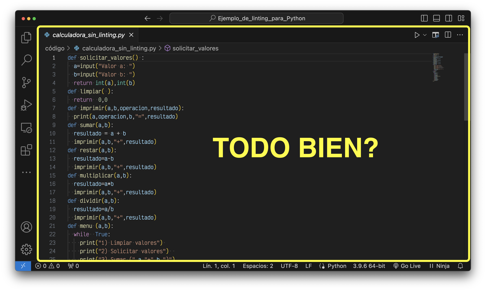
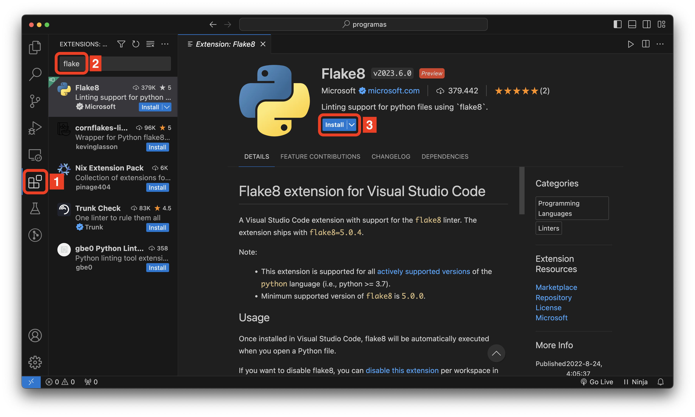
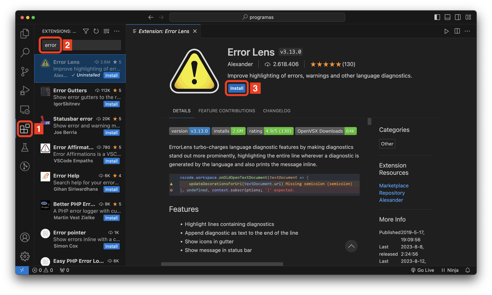
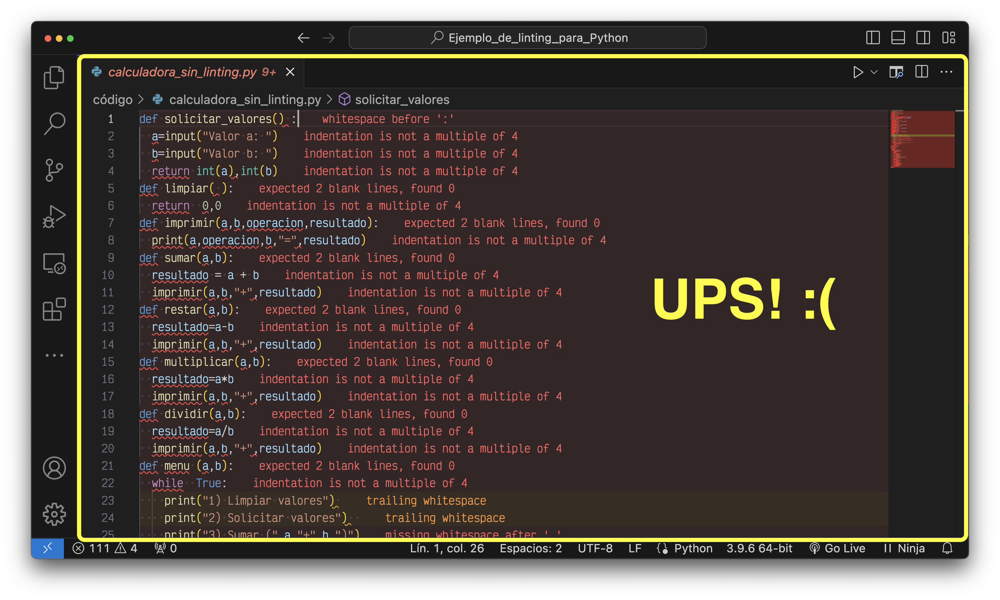
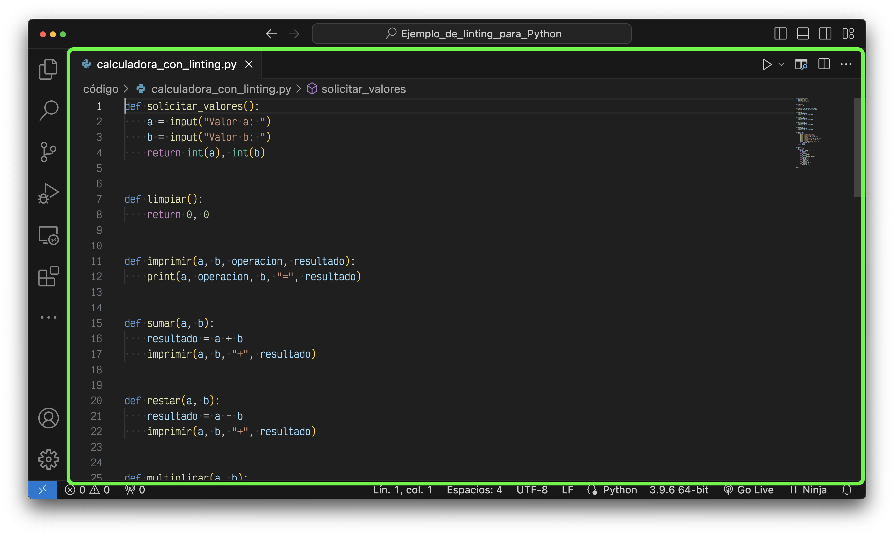

# Ejemplo de Linting para Python

  </a>

> ¿Qué es **Linting**? **Linting** es el proceso de verificación automática del **código fuente** en busca de **errores programáticos y estilísticos**.

## Recursos Necesarios

- ### 💻 [Visual Studio Code](https://code.visualstudio.com/)
  - #### Extensiones de Visual Studio Code
    - ##### 🐍 [Python](https://marketplace.visualstudio.com/items?itemName=ms-python.python)
    - ##### 💁🏻 [Python Preview](https://marketplace.visualstudio.com/items?itemName=dongli.python-preview) (❌ No puede usar `input` ⌨️)    
- ### 👨🏻‍💻 [Learn Python, JavaScript, C, C++, and Java](https://pythontutor.com/)

## ⬆️ Antes 

- ### 🗒️ [calculadora_sin_linting.py](codigo/calculadora_sin_linting.py) 👎

- ### 💻 Visual Studio Code sin extensión Flake8 
  ### (NOTA: ❌ Existen los errores pero no se observan 🙈)
  

## Extensiones de Visual Studio Code

- ### 🔦 [Flake8](https://marketplace.visualstudio.com/items?itemName=ms-python.flake8) 
- ### 🔍 [Error Lens](https://marketplace.visualstudio.com/items?itemName=usernamehw.errorlens) 

## 🔽 Despues 

- ### 🗒️ [calculadora_sin_linting.py](codigo/calculadora_sin_linting.py) 👎

- ### 💻 Visual Studio Code con extensión Flake8 y Error Lens 
  ### (NOTA: ❌ Existen los errores y se observan 🔎)
  

- ### 3 doritos despues...
  </img>

- ### 🗒️ [calculadora_con_linting.py](codigo/calculadora_con_linting.py) 👍

- ### 💻 Visual Studio Code con extensión Flake8 y Error Lens 
  ### (✔️ Ya no existen los errores)
  

    
  

<h6>HECHO CON 💛 POR NELBREN EL 2023-09-14</h6>

